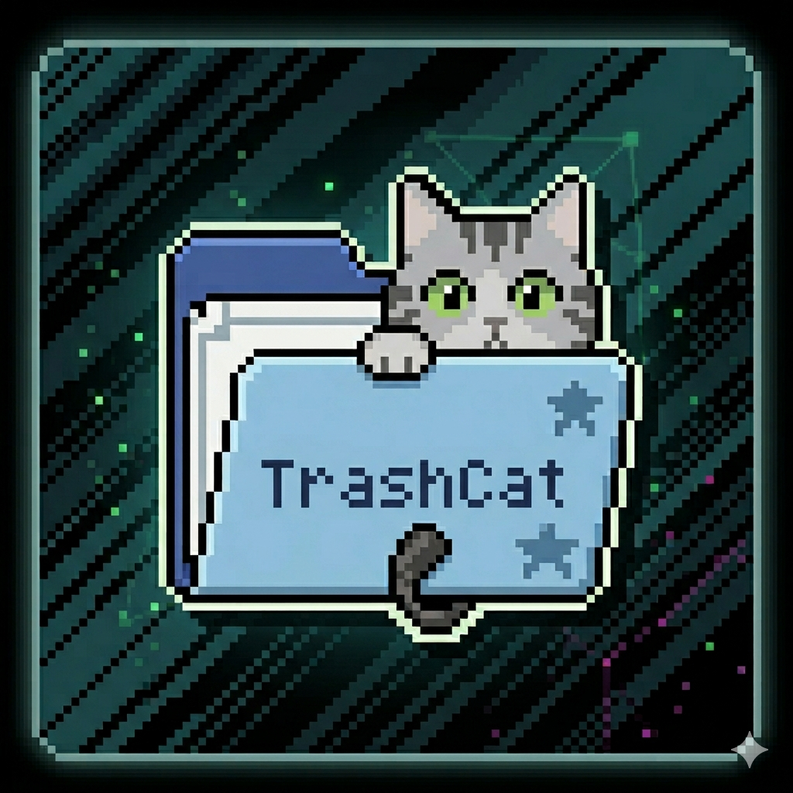

# 🐱 TrashCat — 你的 Mac 捕鼠官

<p align="center">
  
</p>

<p align="center">
  <strong>垃圾就像老鼠。TrashCat 是那只抓老鼠的猫。</strong>
</p>

<p align="center">
  <a href="#-背景故事">背景故事</a> •
  <a href="#-功能">功能</a> •
  <a href="#-安装">安装</a> •
  <a href="#-技术栈">技术栈</a> •
  <a href="#-开发">开发</a>
</p>

---

## 📖 背景故事

你的 Mac 是一座大房子。

你每天在里面工作、娱乐、创造。偶尔觉得某个应用没用了，把它拖进废纸篓，清空——以为这就完事了。

**但事情没那么简单。**

你把应用赶出了大门，它却在你看不到的角落里留下了窝：藏在 `~/Library` 深处的配置文件，躲在 `Caches` 夹层里的缓存，窝在 `Containers` 暗处的沙盒数据……日积月累，几十 GB 的「老鼠」在你的 Mac 里繁衍生息。

市面上的所谓「灭鼠公司」要么收年费（CleanMyMac $40/年），要么进门就到处装摄像头（遥测），要么给你一本厚厚的《灭鼠手册》让你自己学（OnyX）。

**我们只想要一只猫。一只好猫。**

于是有了 TrashCat——开源、免费、不偷看，一个专门在你 Mac 里找出「数字老鼠」并判断能不能抓的猫。

它不会把复杂路径丢给你猜，也不会为了扫出更大的数字乱碰用户数据。它会先判断哪些可以放心清理，哪些需要解释后确认，哪些只是空间诊断。

---

> *Every Mac deserves a good mouser. Meet yours.* 🐱

---

## ✨ 这是干什么的

- 🐭 **抓老鼠（安全清理）**——默认只清理确定安全的缓存、日志、临时文件，28 条规则驱动
- 🪹 **闻老鼠窝（空间诊断）**——找出 iOS 备份、Xcode 归档、Docker、聊天软件等大块占用
- 🧭 **帮你判断**——按「推荐清理 / 需要确认 / 谨慎处理」三层风险展示，每项标注影响说明
- 🎮 **猫捉老鼠动画**——扫描时 🐱 追 🐭 的 Canvas 动画，"已捕获 X 只老鼠"
- 📡 **实时进度**——扫描时显示已扫描目录数、已发现文件数，进度条同步更新
- ⚡ **并发扫描**——TaskGroup 并行，速度提升 2-3x，随时可取消
- 📊 **交差（清理报告）**——按分类展示释放明细，一键打开废纸篓恢复文件
- 🔒 **100% 本地**——不上传任何数据，不联网，不开后门，代码全开源

## 📦 领养一只 TrashCat

### 下载 DMG

> 从 [Releases](https://github.com/lunzi1992/TrashCat/releases) 页面下载最新 `.dmg`，双击挂载后拖进 Applications。

**安装后，首次启动前务必运行：**

```bash
xattr -cr /Applications/TrashCat.app
```

> ⚠️ 如果不运行此命令，macOS 会将 app 移到临时路径运行（App Translocation），
> 导致即使你授予了"全磁盘访问"权限，授权弹窗也会一直弹出。
> 这是因为 TrashCat 使用 ad-hoc 签名（开源免费），不是安全问题。

如果跳过上面步骤直接打开，macOS 会提示"无法验证开发者"——右键点击 TrashCat →「打开」→「打开」即可。但**仍需运行上面的 `xattr -cr` 命令**才能正常授权。

TrashCat 100% 本地运行，不联网，代码全公开可审计。

### 自己编译

```bash
git clone https://github.com/lunzi1992/TrashCat.git
cd TrashCat
open TrashCat.xcodeproj
# Xcode → Product → Archive
```

**或者一行命令打 DMG**：

```bash
git clone https://github.com/lunzi1992/TrashCat.git
cd TrashCat
./scripts/build-dmg.sh 0.3.1
# 产出 TrashCat-0.3.1.dmg
```

**系统要求**：macOS 13 (Ventura) 以上，Universal 构建，支持 Apple Silicon 与 Intel Mac。

## 🛠 这只猫什么构造

| 部位 | 材料 |
|------|------|
| 骨架 | Swift 5.9+ |
| 皮毛 | SwiftUI |
| 神经 | MVVM |
| 地盘 | macOS 13 Ventura+，Apple Silicon / Intel Mac |
| 外包装 | DMG（ad-hoc 签名） |
| 血缘 | 纯 Apple 框架，零外部依赖 |

## 🏗 猫窝结构

```
trashcat/
├── TrashCat/
│   ├── TrashCatApp.swift        # 猫脑袋（入口）
│   ├── ContentView.swift        # 状态机主容器
│   ├── Engine/                  # 猫鼻子（扫描引擎）
│   │   └── Scanners/            # RuleScanner + 浏览器/残留
│   ├── Model/                   # 猫的脑子
│   │   ├── ScanModels.swift     # CleanItem/CleanRule/RiskLevel
│   │   └── RuleRegistry.swift   # 28 条清理规则
│   ├── UI/                      # 猫的脸
│   └── Utils/                   # 猫爪子
│       ├── RiskAssessor.swift
│       ├── FileCategorizer.swift
│       ├── ScanPolicy.swift
│       └── PermissionManager.swift
├── TrashCatTests/               # 猫的体检报告（6 个测试文件，120+ 断言）
├── Resources/                   # 猫粮（图标）
├── scripts/                     # 打包脚本（build-dmg.sh）
├── docs/                        # 猫的档案
    ├── prd.md
    ├── scan-policy.md
    ├── competitive-analysis.md
    └── development-plan.md
└── deliverables/                # 产品评估报告
```

## 🔒 猫的品格

- **不出门**——不需要网络权限，断网照常干活
- **不偷看**——零遥测、零埋点、零崩溃上报
- **不撒谎**——代码全开源，每个人都可以审计每一行
- **不逞强**——默认只清理确定安全的内容，不把系统关键路径和用户数据混进一键清理
- **不惹事**——文件先叼进废纸篓而非直接删除，后悔来得及

## 🤝 一起养猫

欢迎投喂！Issues、PR、建议、星星，来者不拒。

```bash
# 领回家
gh repo fork lunzi1992/TrashCat --clone

# 开新窝
git checkout -b feature/your-feature

# 交作业
gh pr create
```

## 📄 许可

MIT License — 随便养、随便改、随便送人。

---

<p align="center">
  <i>TrashCat 在睡觉。你的 Mac 在变脏。快醒醒它。</i>
</p>

<p align="center">
  <sub>🐱 Made by <a href="https://github.com/lunzi1992">lunzi</a> · Hefei · 2026</sub>
</p>
